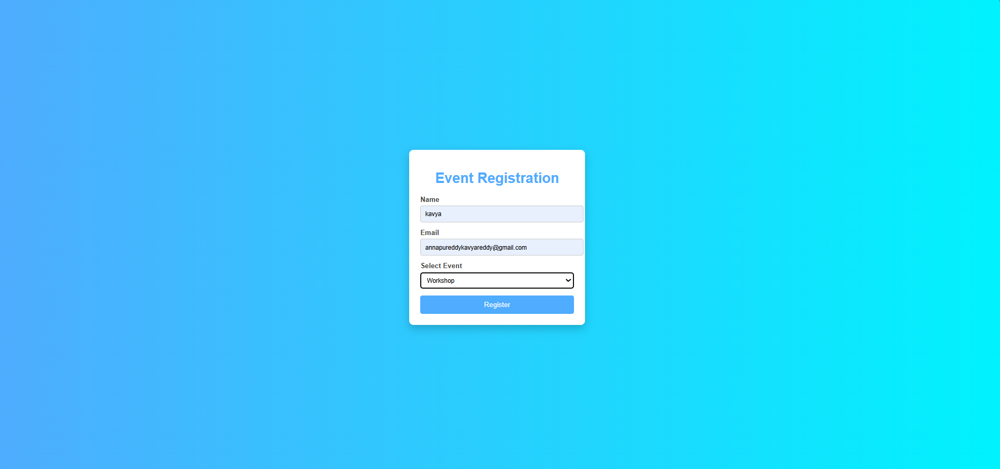

# Ex09 Event Registration Web Application
# Date:24-12-2025
# AIM:
To design, develop and deploy a web application for event registration.

# DESIGN STEPS:
## Step 1:
Create a new frame.

## Step 2:
Select any one preset size of your choice.

## Step 3:
Select the shapes you need.

## Step 4:
Import images as needed.

## Step 5:
Create pages based on your need and link them.

## Step 6:
Validate the HTML and CSS code.

## Step 6:
Publish the website in the given URL.

# DESIGN TOOL:
Figma

# CODE:
<!DOCTYPE html>
<html lang="en">
<head>
    <meta charset="UTF-8">
    <title>Event Registration</title>
    <link rel="stylesheet" href="style.css">
</head>
<body>

    <form>
        <h1 style="color:#4facfe;">Event Registration</h1>

        <label for="name">Name</label>
        <input type="text" id="name" placeholder="Enter your name" required>

        <label for="email">Email</label>
        <input type="email" id="email" placeholder="Enter your email" required>

        <label for="event">Select Event</label>
        <select id="event">
            <option>Workshop</option>
            <option>Seminar</option>
            <option>Conference</option>
        </select>

        <button type="submit">Register</button>
    </form>

</body>
</html>
/* Page background */
body {
    margin: 0;
    padding: 0;
    font-family: Arial, Helvetica, sans-serif;
    background: linear-gradient(to right, #4facfe, #00f2fe);
    height: 100vh;
    display: flex;
    justify-content: center;
    align-items: center;
}

/* Form container */
form {
    background-color: #ffffff;
    padding: 25px;
    width: 350px;
    border-radius: 10px;
    box-shadow: 0px 8px 20px rgba(0, 0, 0, 0.2);
}

/* Heading */
h1 {
    text-align: center;
    color: #333333;
    margin-bottom: 20px;
}

/* Labels */
label {
    display: block;
    margin-bottom: 5px;
    color: #444444;
    font-weight: bold;
}

/* Input fields and dropdown */
input[type="text"],
input[type="email"],
select {
    width: 100%;
    padding: 10px;
    margin-bottom: 15px;
    border: 1px solid #cccccc;
    border-radius: 5px;
    font-size: 14px;
}

/* Submit button */
button {
    width: 100%;
    padding: 12px;
    background-color: #4facfe;
    color: white;
    border: none;
    border-radius: 5px;
    font-size: 16px;
    cursor: pointer;
}

/* Button hover effect */
button:hover {
    background-color: #0078ff;
}

# OUTPUT:

# RESULT:
The program to design, develop and deploy a web application for event registration is completed successfully.
